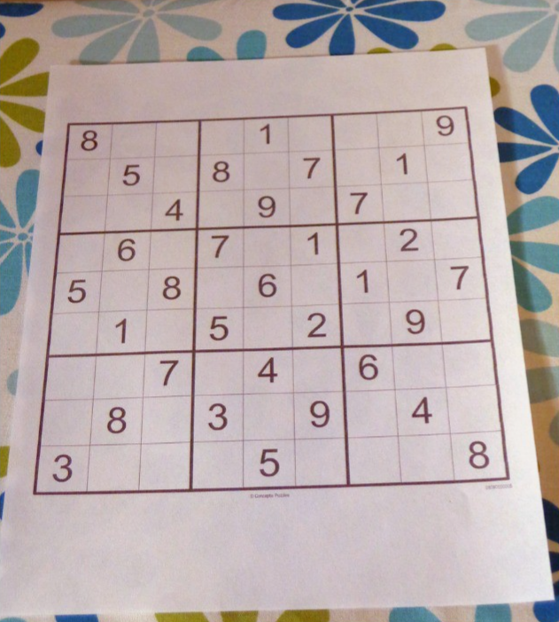

# CLI Sudoku Solver
A simple sudoku solver written in Python. It is very fast and can solve any sudoku puzzle.

## Menu
- [Features](#features)
- [Installation and Usage](#installation-and-usage)
- [Libraries Used](#libraries-used)
- [Training](#training)
- [Example Output](#example)
- [License](LICENSE)

## Features
* Can extract a sudoku puzzle from an image
* Manually enter the initial state of the puzzle
* Modify the puzzle
* CLI
* Uses Classes, so it can be easily integrated into other projects


## Installation and Usage
1. Clone the repository  
  `git clone https://github.com/PrathamGupta06/sudoku-solver.git`
2. Navigate to the directory  
  `cd sudoku-solver`
3. Create a virtual environment  
  `python3 -m venv venv`
4. Activate the virtual environment  
  (Windows) `.\venv\Scripts\activate`  
  (Linux) `source venv/bin/activate`  
5. Install the requirements  
  `pip install -r requirements.txt`
6. Run the script  
   `python main.py`

## Libraries Used
- [opencv-python](https://pypi.org/project/opencv-python/)
- [numpy](https://pypi.org/project/numpy/)
- [tensorflow](https://pypi.org/project/tensorflow/)

## Training
The model to identify digits was trained using the [Printed Digits Dataset](https://www.kaggle.com/datasets/kshitijdhama/printed-digits-dataset) from Kaggle. The model was trained for 10 epochs with a batch size of 10. The model was saved as `model.h5`.

## Example
The image used in the below example

```
python main.py
Importing Libraries...
----------------------------------------

  MAIN MENU
  
1. Enter Sudoku Manually
2. Enter Sudoku from an Image
3. Enter 2D Array Sudoku

9. Exit

----------------------------------------
Enter your choice: 3
----------------------------------------
----------------------------------------
Example of 2d Array sudoku = [[1,2,3,4,5,6,7,8,9],[4,5,6,7,8,9,1,2,3],[7,8,9,1,2,3,4,5,6],[2,3,4,5,6,7,8,9,1],[5,6,7,8,9,1,2,3,4],[8,9,1,2,3,4,5,6,7],[3,4,5,6,7,8,9,1,2],[6,7,8,9,1,2,3,4,5],[9,1,2,3,4,5,6,7,8]]
Enter the sudoku as a 2D array: 
[[6, 5, 0, 8, 0, 9, 0, 0, 0], [0, 0, 0, 5, 0, 0, 8, 0, 7], [0, 0, 1, 0, 4, 0, 0, 9, 0], [0, 0, 9, 1, 0, 0, 0, 0, 0], [2, 0, 0, 0, 0, 0, 0, 0, 8], [0, 0, 0, 0, 0, 2, 6, 0, 0], [0, 3, 0, 0, 2, 0, 7, 0, 0], [1, 0, 2, 0, 0, 8, 0, 0, 0], [0, 0, 0, 3, 0, 1, 0, 4, 5]]
Current Sudoku:

6 5 0 | 8 0 9 | 0 0 0 
0 0 0 | 5 0 0 | 8 0 7 
0 0 1 | 0 4 0 | 0 9 0 
------|-------|------
0 0 9 | 1 0 0 | 0 0 0 
2 0 0 | 0 0 0 | 0 0 8 
0 0 0 | 0 0 2 | 6 0 0 
------|-------|------
0 3 0 | 0 2 0 | 7 0 0 
1 0 2 | 0 0 8 | 0 0 0 
0 0 0 | 3 0 1 | 0 4 5 

Sudoku Solved Successfully
Solved Sudoku

6 5 7 | 8 3 9 | 1 2 4 
9 2 4 | 5 1 6 | 8 3 7 
3 8 1 | 2 4 7 | 5 9 6 
------|-------|------
4 6 9 | 1 8 5 | 3 7 2 
2 7 5 | 6 9 3 | 4 1 8 
8 1 3 | 4 7 2 | 6 5 9 
------|-------|------
5 3 6 | 9 2 4 | 7 8 1 
1 4 2 | 7 5 8 | 9 6 3 
7 9 8 | 3 6 1 | 2 4 5 

Solved in 0.3234217166900635 seconds, and 56540 different possibilities were tried.
----------------------------------------

  MAIN MENU
  
1. Enter Sudoku Manually
2. Enter Sudoku from an Image
3. Enter 2D Array Sudoku

9. Exit

----------------------------------------
Enter your choice: 2
----------------------------------------
Enter the path of the image: sample/sudoku3.png
3/3 [==============================] - 0s 3ms/step
Sudoku Extracted Successfully and it took 0.8528652191162109 seconds to extract the sudoku
----------------------------------------
Your sudoku is

8 0 0 | 0 1 0 | 0 0 9 
0 5 0 | 8 0 7 | 0 1 0 
0 0 4 | 0 9 0 | 7 0 0 
------|-------|------
0 6 0 | 7 0 1 | 0 2 0 
5 0 8 | 0 6 0 | 1 0 7 
0 1 0 | 5 0 2 | 0 9 0 
------|-------|------
0 0 7 | 0 4 0 | 6 0 0 
0 8 0 | 3 0 9 | 0 4 0 
3 0 0 | 0 5 0 | 0 0 8 

----------------------------------------
   EXTRACTION MENU
1. Modify the Sudoku
2. Show the solution of the sudoku

9. Exit to main menu
----------------------------------------
Enter your choice: 2
----------------------------------------
----------------------------------------
Solving the Sudoku
Sudoku Solved Successfully
Solved Sudoku

8 7 2 | 4 1 3 | 5 6 9 
9 5 6 | 8 2 7 | 3 1 4 
1 3 4 | 6 9 5 | 7 8 2 
------|-------|------
4 6 9 | 7 3 1 | 8 2 5 
5 2 8 | 9 6 4 | 1 3 7 
7 1 3 | 5 8 2 | 4 9 6 
------|-------|------
2 9 7 | 1 4 8 | 6 5 3 
6 8 5 | 3 7 9 | 2 4 1 
3 4 1 | 2 5 6 | 9 7 8 

Solved in 0.006405830383300781 seconds, and 137 different possibilities were tried.
----------------------------------------

  MAIN MENU
  
1. Enter Sudoku Manually
2. Enter Sudoku from an Image
3. Enter 2D Array Sudoku

9. Exit

----------------------------------------
Enter your choice: 1
----------------------------------------

MANUAL INPUT MENU 
       
Please enter each line of sudoku one by one, with empty blocks as 0s and press enter after each line.
For example if your row is: 1 2 3 4 5 _ 7 8 9
Then you should enter: 123450789
----------------------------------------
Enter row 1: 800010009
Enter row 2: 050807010
Enter row 3: 004090700
Enter row 4: 060701020
Enter row 5: 508060107
Enter row 6: 010502090
Enter row 7: 007040600
Enter row 8: 080309040
Enter row 9: 300050008
Sudoku Entered Successfully
----------------------------------------
Current Sudoku:

8 0 0 | 0 1 0 | 0 0 9 
0 5 0 | 8 0 7 | 0 1 0 
0 0 4 | 0 9 0 | 7 0 0 
------|-------|------
0 6 0 | 7 0 1 | 0 2 0 
5 0 8 | 0 6 0 | 1 0 7 
0 1 0 | 5 0 2 | 0 9 0 
------|-------|------
0 0 7 | 0 4 0 | 6 0 0 
0 8 0 | 3 0 9 | 0 4 0 
3 0 0 | 0 5 0 | 0 0 8 

1. Show the solution of the sudoku
2. Modify the sudoku
9. Exit to main menu
----------------------------------------
Enter your choice: 1
Sudoku Solved Successfully
Solved Sudoku

8 7 2 | 4 1 3 | 5 6 9 
9 5 6 | 8 2 7 | 3 1 4 
1 3 4 | 6 9 5 | 7 8 2 
------|-------|------
4 6 9 | 7 3 1 | 8 2 5 
5 2 8 | 9 6 4 | 1 3 7 
7 1 3 | 5 8 2 | 4 9 6 
------|-------|------
2 9 7 | 1 4 8 | 6 5 3 
6 8 5 | 3 7 9 | 2 4 1 
3 4 1 | 2 5 6 | 9 7 8 

Solved in 0.000997304916381836 seconds, and 137 different possibilities were tried.
----------------------------------------

  MAIN MENU
  
1. Enter Sudoku Manually
2. Enter Sudoku from an Image
3. Enter 2D Array Sudoku

9. Exit

----------------------------------------
Enter your choice: 9
----------------------------------------

```
